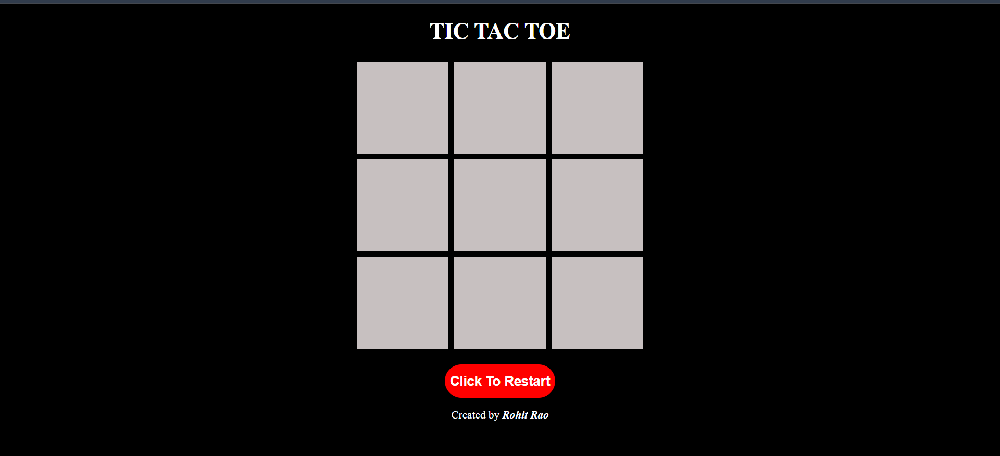
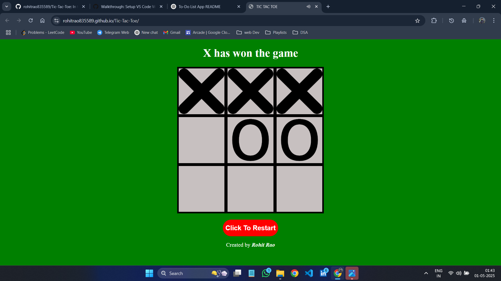
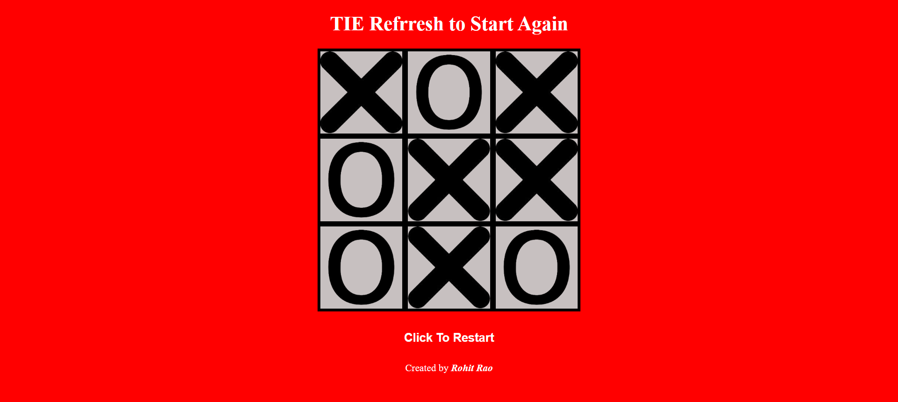

# 🎮 Tic-Tac-Toe Game

A simple, interactive, and responsive **Tic-Tac-Toe** game built using **HTML**, **CSS**, and **JavaScript**. Challenge a friend and enjoy the classic game with a clean UI and smooth gameplay.

🔗 **[Live Demo](https://rohitrao835589.github.io/Tic-Tac-Toe/)**

---

## 📸 Demo

- **🏠 Home Screen**

  

- **✅ Winning Screen**

  

- **🤝 Tie Screen**

  

---

## 🚀 Features

- Two-player game (Player X and Player O)
- Winning and tie conditions handled with animations
- Reset and play again functionality
- Fully responsive for desktop and mobile devices
- Clean UI and intuitive design

---

## 🛠️ Tech Stack

- **HTML5**
- **CSS3**
- **JavaScript (Vanilla)**

---

## 📁 Folder Structure

```
├── assets/             # Images for game states
├── index.html          # Entry point
├── style.css           # Styling
├── script.js           # Game logic
└── README.md
```

---

## 🧩 How to Play

1. Open the [live link](https://rohitrao835589.github.io/Tic-Tac-Toe/).
2. Player X starts first.
3. Take turns placing your mark in an empty square.
4. First to align 3 marks horizontally, vertically, or diagonally wins.
5. If all 9 squares are filled without a winner, it's a tie!
